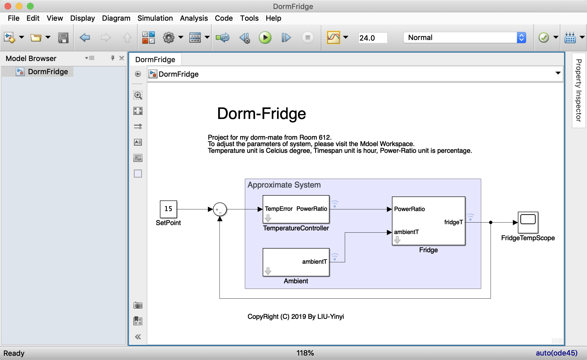
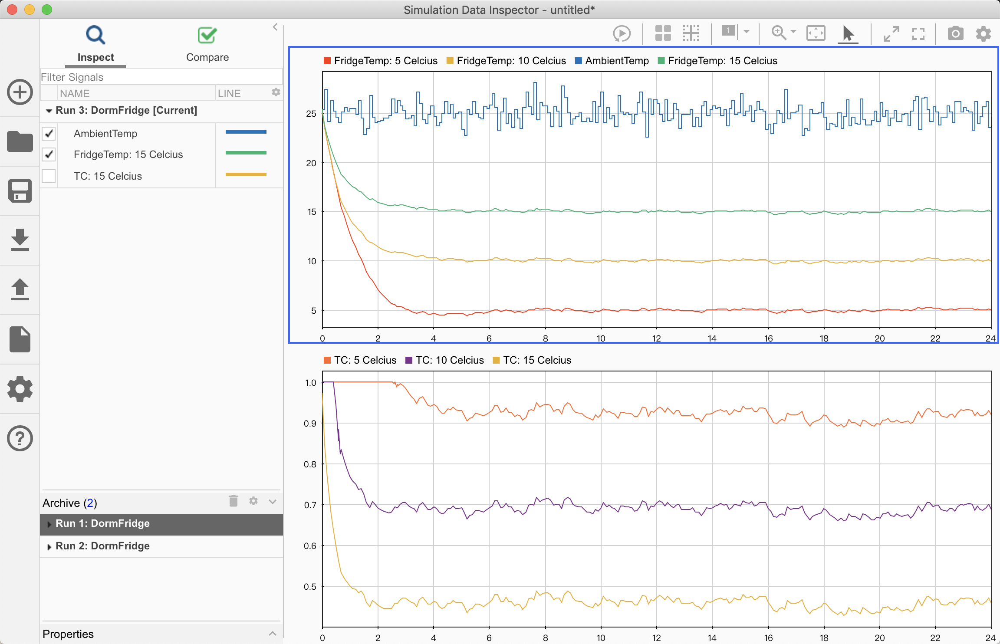
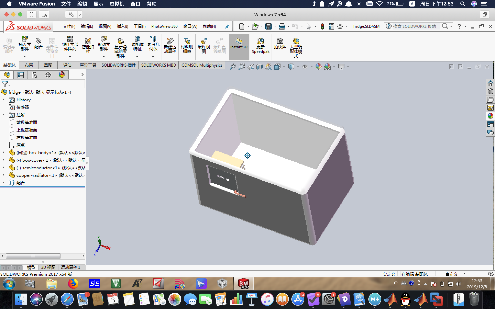
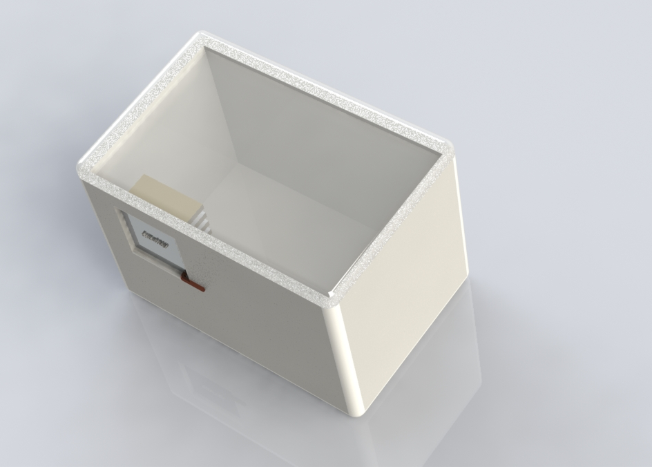

# Project: Dorm-Fridge
- **Author:** LIU-Yinyi
- **Date:** 2019-12-08
- **Version:** 2.0.0 [ *ReForge* ]
- **Abstract:** An individual project which helped my dorm mates build up a simple fridge for ice-drink.

---

## 1. Background & Brief
This is a project done when I was a sophomore-level student. It was a burning hot summer and my dorm mates wanted some ice-drink but nothing could be used as a cooler and there was no room for a normal size refrigerator in our dorm. It just so happended that our physics class introduced **Peltier Semiconductor** to us as a heat transfer device. As a result, I took attempts to make one based on this theory.

This project has been re-forged and contains three parts: *Simulation, Mechanics and McuCodes*. The *Simulation* directory covers a simulink project to mimic the heat transfer procedure between dorm-fridge and ambient enviroment as well as a simple PID controller for Microprocessor Central Unit. The result helps us test the temperature-control algorithm and estimate the timespan of cooling-process. Objects Matrices as Solidworks format type are saved in the *Mechanics* part. Corresponding source codes for MCU are comprised in the *McuCodes* directory.

## 2. Overview & Figure
System Design in Simulink:

Simulation Result in Data-Inspector: (Ambient: , TargetPoint: )

Object Model in Solidworks:

Object Render in Solidworks: (No Videocard in my Mac so it might be coarse)

## 3. Theoretical Narrative
Firstly the box of fridge was devised at a size of 180mm x 270mm x 190mm. The volume is . Here we suppose that the average density of the air is  so the mass of air is . The specific heat capacity of air that could be found from books is .

Secondly the convection heat flow was simplified into a dissipation constant, which described as an equation: , where  is the difference between fridge temperature and ambient temperature. Note here  unit is .

Thirdly the temperature controller could vary power ratio as  to control the cooling process. The real-time power is ratio  multiply maximum power . The equation could be defined as: .

For fridge simulation, heat transfer followed the equation: , where  and  indicates the fridge and ambient temperature respectively. Fridge absorbs the heat as a result of negative symbol.

## 4. References
[1] Mathworks, Inc. (August, 2019). Simulink Tutorials and Documents. Retrieve from: `https://ww2.mathworks.cn/help/index.html?s_tid=CRUX_lftnav`

[2] Picard, Alain, et al. "Revised formula for the density of moist air (CIPM-2007)." Metrologia 45.2 (2008): 149.
